<h1 align="left">:computer: ESLint_JavaScript_Cypress  </h1>

This is a simple and detailed tutorial to use ESLint in your code

## Introduction

This project contains a tutorial for installation and use code analysis tool <a href="eslint.org">ESLint</a>.
ESLint statically analyzes your code to quickly find problems. ESLint is built into most text editors and you can run ESLint as part of your continuous integration pipeline.
ESLint can to check syntax, find problems, and enforce code style.


## Environment Setup

**Prerequisites:**
* <a href="https://docs.npmjs.com/cli/v6/commands/npm-install"> npm </a>

## Flags npm

`npm install` saves any specified packages into `dependencies` by default.
Additionally, you can control where and how they get saved with some
additional flags:

* `-P, --save-prod`: Package will appear in your `dependencies`. This is the default unless `-D` or `-O` are present.
* `-D, --save-dev`: Package will appear in your `devDependencies`.
* `-O, --save-optional`: Package will appear in your `optionalDependencies`.
* `--no-save`: Prevents saving to `dependencies`.

**Learn more:**
* <a href="https://docs.npmjs.com/cli/v6/commands/npm-install"> npm intall </a>

### 📌dependencies: programs needed for production

`dependencies` are all the programs needed for the application to work. The application depends on them and they must be installed otherwise the application will not run.

### 📌devDependencies: programs used for development

`devDependencies` are all the programs necessary for the "dev" environment, development, of the application. It can be everything from code compressors, transpilers, unit tests, debug tools, etc. These are not necessary for the application to work, but for development and/or testing.

### 📌optionalDependencies

`optionalDependencies` are dependencies that don’t necessarily need to be installed. If a dependency can be used, but you would like npm to proceed if it cannot be found or fails to install, then you may put it in the `optionalDependencies` object.

## Installing and Starting ESLint:
- Install ESLint:
```
npm install -D eslint
```

- Initializing ESLint:
```
npx eslint --init
```
## Config ESLint:
### Configure eslint according to your project

✔️ Defining for what purpose to use eslint:
<p align="left">
  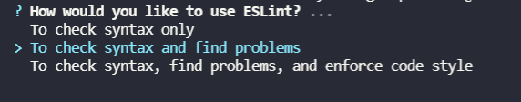
</p>

✔️ Defining what kind of modules we use in our project:
<p align="left">
  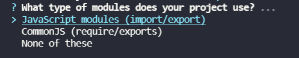
</p>

✔️ Defining if you are using some Framework:
<p align="left">
  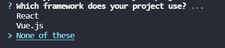
</p>

✔️ Defining whether we are using Typescript:
<p align="left">
  
</p>

✔️ Defining the destination of your code. Whether it will run in the browser or in Node:
<p align="left">
  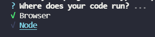
</p>

✔️ Defining the style that we will follow in our code:
<p align="left">
  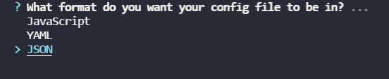
</p>

✔️ Choosing the style guide:
<p align="left">
  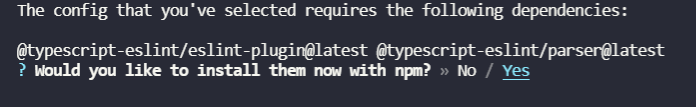
</p>

✔️ Defining the file format in which you can perform some additional ESLint settings:
<p align="left">
  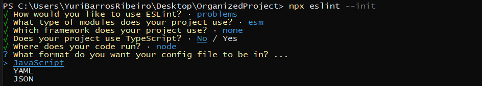
</p>


⚠️ After the previous step, you will be asked if you want to install the dependencies related to the chosen style guide, frameworks and TypeScript.

✔️ Confirm
<p align="left">
  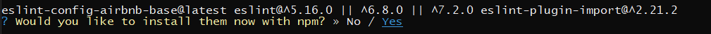
</p>

## Config file:
After the configuration, your project will have a file (.eslintrc) like this:

- .eslintrc.json
```
{
    "env": {
        "browser": true,
        "es2021": true
    },
    "extends": [
        "eslint:recommended",
        "plugin:@typescript-eslint/recommended"
    ],
    "parser": "@typescript-eslint/parser",
    "parserOptions": {
        "ecmaVersion": "latest",
        "sourceType": "module"
    },
    "plugins": [
        "@typescript-eslint"
    ],
    "rules": {}
}
```

## Eslint with Cypress
By default eslint does not recognize cypress command

<p align="left">
  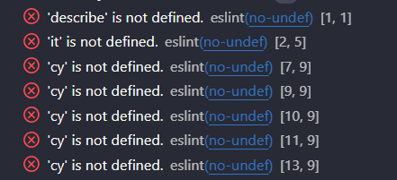
</p>

### ✅ Solution
Just install puglin <a href="https://www.npmjs.com/package/eslint-plugin-cypress">eslint-plugin-cypress</a> and add an extension to the file .eslintrc

- Install eslint-plugin-cypress
```
npm install -D eslint-plugin-cypress
```

- Add extension to the file .eslintrc

"plugin:cypress/recommended" in extends
```
    "extends": [
        "eslint:recommended",
        "plugin:@typescript-eslint/recommended",
        "plugin:cypress/recommended"
        
    ],
```

## Run ESLint
- Run ESLint in an file 
```
npx eslint file.js
```

- Run ESLint in an folder
```
npx eslint "cypress\integration\**"
```

<p align="left">
  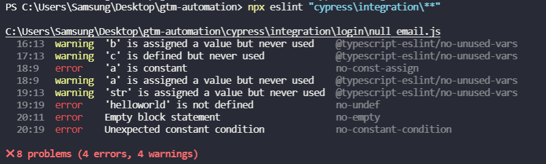
</p>
</br>

## File .eslintignore
To avoid false negative processes and unnecessary analysis in the project, we can create the exception file .eslintignore

<p align="left">
  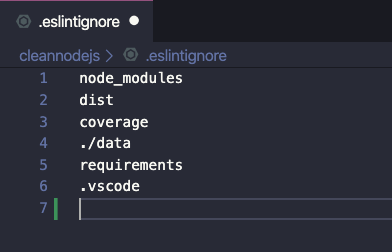
</p>
</br>

**Files**
- node_modules: third-party library directory;
- dist: directory of publishing files with JavaScript files;
- coverage: stores test reports generated by Coverage;
- ./data: directory that we will use to keep the data, when we containerize our API;
- requirements: repository where we will keep our API documentation;
- .vscode: and VSCode editor configuration file that we will use when we configure the debug process.

## Rules ESLint
ESLint allows rules to be added 
Learn more at <a href="https://eslint.org/docs/rules/">ESLint Rules</a>.

## Configuring VS Code with ESLint

Install the ESLint extension in VS Code. To do this, in your VS Code, click on the extensions button, search for “eslint” and install the corresponding extension:

<p align="left">
  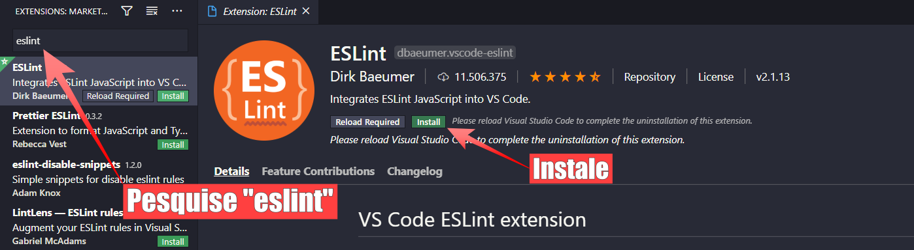
</p>

## VS Code
Restart VS Code and you will see the warnings in your project code

Example:

<p align="left">
  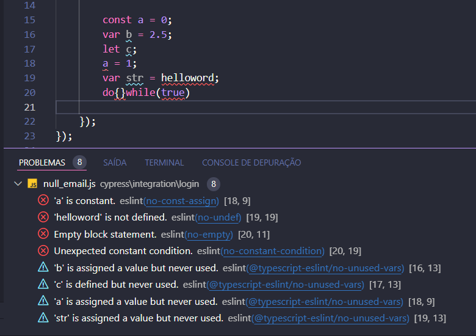
</p>


## Author
<a target="_blank" href="https://github.com/jasonwillyan">👤 Jason Willyan </a>

<a target="_blank" href="mailto:jasonwillyan@hotmail.com">
  
</a>


