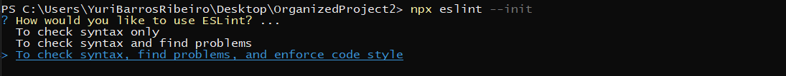
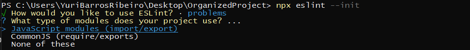
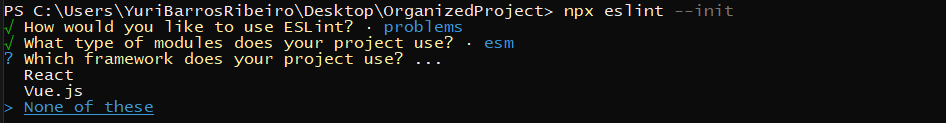
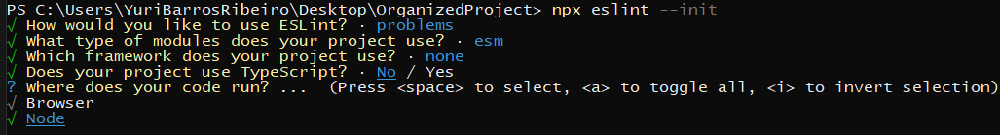
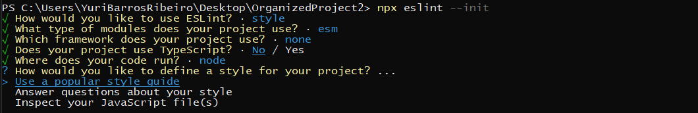
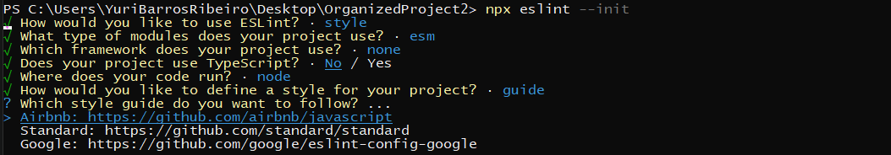
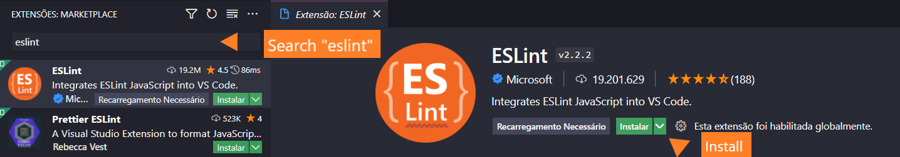

<h1 align="left">:computer: ESLint-Test-Cypress-JavaScript  </h1>

This is a simple and detailed tutorial to use ESLint in your code

## Introduction

This project contains a tutorial for installation and use code analysis tool <a href="eslint.org">ESLint</a>.
ESLint statically analyzes your code to quickly find problems. ESLint is built into most text editors and you can run ESLint as part of your continuous integration pipeline.
ESLint can to check syntax, find problems, and enforce code style.


## Environment Setup

**Prerequisites:**
* <a href="https://nodejs.org/en/download/"> NodeJS </a>
* <a href="https://docs.npmjs.com/cli/v6/commands/npm-install"> npm </a>

## Installing and Starting ESLint:
- Install ESLint:
```
npm install -D eslint
```

- Initializing ESLint:
```
npx eslint --init
```
## Config ESLint:
### Configure eslint according to your project

✔️ Defining for what purpose to use eslint:
<p align="left">
  
</p>

✔️ Defining what kind of modules we use in our project:
<p align="left">
  
</p>

✔️ Defining if you are using some Framework:
<p align="left">
  
</p>

✔️ Defining whether we are using Typescript:
<p align="left">
  
</p>

✔️ Defining the destination of your code. Whether it will run in the browser or in Node:
<p align="left">
  
</p>

✔️ Defining the style that we will follow in our code:
<p align="left">
  
</p>

✔️ Choosing the style guide:
<p align="left">
  
</p>

✔️ Defining the file format in which you can perform some additional ESLint settings:
<p align="left">
  
</p>


⚠️ After the previous step, you will be asked if you want to install the dependencies related to the chosen style guide, frameworks and TypeScript.

✔️ Confirm
<p align="left">
  
</p>

## Config file:
After the configuration, your project will have a file (.eslintrc) like this:

- .eslintrc.json
```
{
    "env": {
        "browser": true,
        "es2021": true
    },
    "extends": [
        "eslint:recommended",
        "plugin:@typescript-eslint/recommended"
    ],
    "parser": "@typescript-eslint/parser",
    "parserOptions": {
        "ecmaVersion": "latest",
        "sourceType": "module"
    },
    "plugins": [
        "@typescript-eslint"
    ],
    "rules": {}
}
```

## Eslint with Cypress
By default eslint does not recognize cypress command

<p align="left">
  
</p>

### ✅ Solution
Just install puglin <a href="https://www.npmjs.com/package/eslint-plugin-cypress">eslint-plugin-cypress</a> and add an extension to the file .eslintrc

- Install eslint-plugin-cypress
```
npm install -D eslint-plugin-cypress
```

- Add extension to the file .eslintrc

"plugin:cypress/recommended" in extends
```
    "extends": [
        "eslint:recommended",
        "plugin:@typescript-eslint/recommended",
        "plugin:cypress/recommended"
        
    ],
```

## Configuring VS Code with ESLint

Install the ESLint extension in VS Code. To do this, in your VS Code, click on the extensions button, search for “eslint” and install the corresponding extension:

<p align="left">
  
</p>


## VS Code
restart VS Code and you will see the warnings in your project code

Example:

<p align="left">
  
</p>


## Author
<a target="_blank" href="https://github.com/jasonwillyan">👤 Jason Willyan </a>

<a target="_blank" href="mailto:jasonwillyan@hotmail.com">
  
</a>


